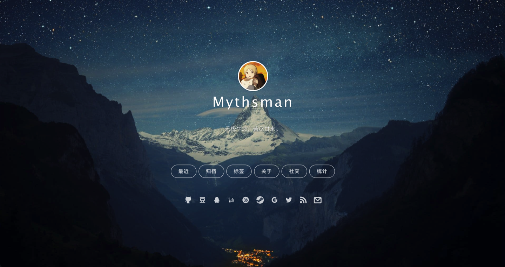
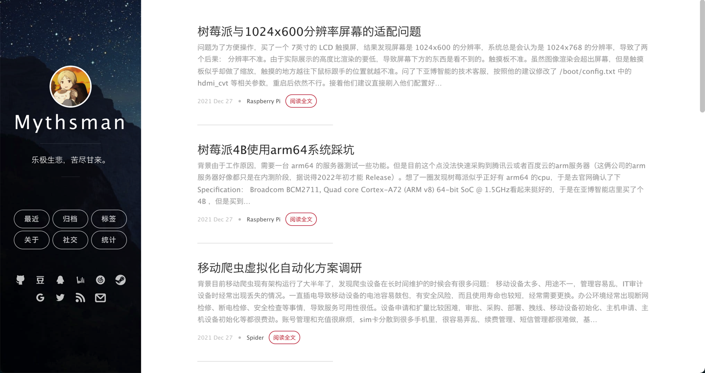
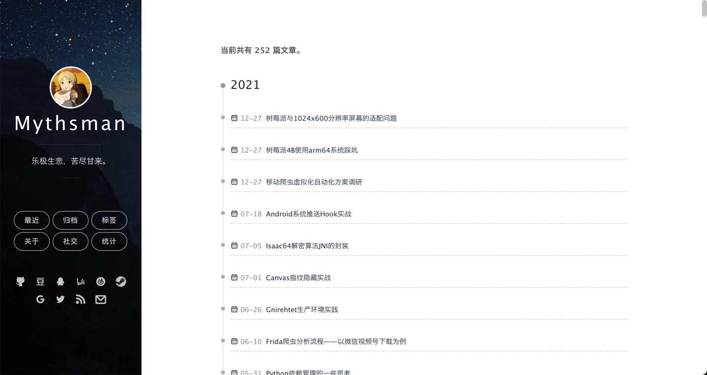
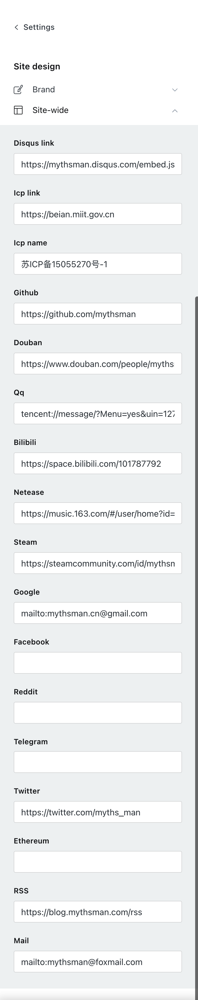
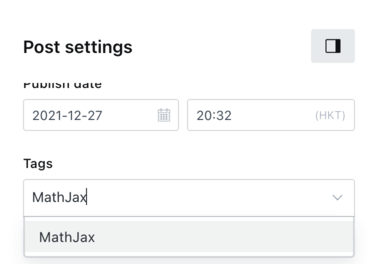

# Mno, just another ghost theme

## Language
[简体中文](./README.zh-CN.md)
[English](./README.md)

## Overview

`Mno` is a reactive double-columned Ghosts theme derived from [Dale Anthony's Uno](https://github.com/daleanthony/uno), [Onevcat's Vno](https://github.com/onevcat/vno) , and  [Litten's Yillia](https://github.com/litten/hexo-theme-yilia) hexo theme, hoping to be concise, easy to configure and efficient.

## Demo
You can refer to my own [blog](https://blog.mythsman.com)




And my gf's [blog](https://mikito.mythsman.com)


## Features

#### Responsive Design and Animation

Mno follows a responsive design, so it should perform well on a variety of devices (PC, Mobile). Many events are driven by animation, thanks to the help of [Animate.css](https://animate.style/).

**Desktop Version**


**Mobile Version**


#### Code Highlighting & MathJax

Use [highlight.js](http://highlightjs.org) plugin, and use [tomorrow-night](https://highlightjs.org/static/demo/) as the theme's code highlighting engine. You can present your code in a clean and beautiful form on your technical blog. At the same time, it integrates [MathJax](https://www.mathjax.org/) on demand to help you present mathematical formulas easily.

Built-in supported types:

Bash C C# C++ CSS Diff Go HTML, XML JSON Java JavaScript Kotlin Less Lua Makefile Markdown Objective-C PHP PHP Template Perl Plain text Python Python REPL R Ruby Rust SCSS SQL Shell Session Swift TOML, also INI TypeScript Visual Basic .NET YAML CMake Dockerfile Gradle Groovy Matlab

#### Ghost custom configuration

All configuration can be done directly through Ghost's [Background Custom Configuration](https://ghost.org/docs/themes/custom-settings/), almost no need to modify the code directly.

#### Minimalist Cover & Social Buttons

The blog homepage adopts a simplified background cover and multiple optional social links, and currently supports the integration of Github, Douban, QQ, Bilibili, Netease, Steam, Twitter, Facebook ,Ethereum , Reddit , Rss, Email and other icons. Thanks to [iconfont vector library](https://www.iconfont.cn/).

#### Unlimited drop down home page

Here we draw on Ghost's official [Casper](https://github.com/TryGhost/Casper/blob/main/assets/js/infinite-scroll.js) theme, and integrates the function of infinite drop-down on the first screen.

#### Archive page and tag cloud integrated

In order to facilitate and quickly retrieve all article titles, the archives page is supported, and a word frequency-based tag cloud is integrated using [jqcloud](https://github.com/lucaong/jQCloud).

**Archives page**


**Tags page**


#### Support integrated Remark42 comments

You can config your remark42\_config in theme config.

## Configure

#### Install

You should already have a working [ghost blog](https://ghost.org) (version > 4.0.0 ). If you are not ready, please refer to the [official installation page](http://docs.ghost.org/installation/) to configure a ghost blog of your own.

Once you're ready, just clone this repo into your blog's theme folder: `content/themes/`, restart ghost, and you should see `Mno` in your blog's settings panel.

#### Blog basic configuration


#### Dynamic routing configuration
Since the home page of this theme is designed as a cover, you need to configure additional routing configuration route.yaml , the suggested configuration is as follows:

```
routes:
/:
template: home

collections:
/posts/:
permalink: /post/{id}/
template: index

taxonomies:
tag: /tag/{slug}/
author: /author/{slug}/

```
Among them, 'template: home' and 'template: index' point to the template file of the current theme, you'd better not to change it.

#### MathJax configuration
MathJax is integrated in the theme, you only need to add a "MathJax" tag when publishing an article to make the article support LaTeX syntax.



#### Archive and tab configuration

1. Manually add a page and set the Page Url to archives to see the archive page under the /archives page.
2. Manually add a page and set the Page Url to tags, then you can see the archive page under the /tags page.


## development

In order to easily modify and develop the theme, you need to install the sass compiler. If you have a local ghost environment, these should already be installed, as these components are required for ghost to run.

You can do some checks in the terminal to see if the installation is complete. If there are no problems, you should be able to see the version number of the corresponding tool after the command line.

#### SASS

Vnos are built on top of SASS, but you can ignore this redevelopment process if you no longer wish to maintain extensibility. But if you know some HTML and CSS, making changes to existing themes is easy.

If SASS is not installed correctly, please refer to [Sass installation page](http://sass-lang.com/install) to install it.

#### Start development

Use the sass command-line tool to watch the scss files in the folder for changes and recompile them automatically.

```bash
pwd
> In the mno theme root folder: {blog_path}/content/themes/mno

sass --watch assets/scss/mno.scss:assets/mno.css
>>>> Sass is watching for changes. Press Ctrl-C to stop.
```

Now, any changes to the scss file will automatically be reflected in the final `mno.css` file.

#### Good luck

Have fun and remember to give me feedback too. If you find any bugs, please point them out, and a pull request to fix it would be greatly appreciated!

If you think this theme is not bad, please add a star or follow me to show your support, it will provide invaluable help to me and the development of my project. Thanks again.

## License

Mno is licensed under [Creative Commons Attribution 4.0 International](http://creativecommons.org/licenses/by/4.0/) as required by Uno. Click the link above for more information.
